# LSTM_HRC

Sequence-model experiments for proactive human-robot collaboration.

This repository studies how to infer a worker's current task step and action status from assembly videos and pose-derived features. The predicted outputs are intended to support proactive robot assistance by helping the system decide what action to take next and when to take it.

## Project Scope

The repository currently includes:

- sequence-model experiments based on LSTM, RNN, and transformer variants
- preprocessing pipelines for 2D and 3D data
- post-processing utilities for analysis and visualization
- application code for inference and viewer tools

## Modeling Ideas

The broader modeling pipeline explores components such as:

- multi-head self-attention
- positional encoding
- add and norm layers
- feed-forward blocks
- step ID conditioning
- step-local history
- element and environment conditioning
- multi-head outputs such as `assist_needed`, assistance type, and assistance timing

## Workflow Overview

1. Record raw assembly videos.
2. Extract pose and feature data from the videos.
3. Annotate the data with `step_id` and `status_id` labels.
4. Convert the labeled data into training-ready tensors.
5. Train and evaluate sequence models.
6. Use the model outputs for downstream robot assistance logic.

For dataset naming and folder conventions, see [folder_structure.md](folder_structure.md).

## Repository Layout

```text
application/        inference entry points and viewer code
data_proc_2d/       2D preprocessing pipeline
data_proc_3d/       3D preprocessing pipeline
model_lstm/         LSTM experiments
model_rnn/          RNN baseline experiments
model_transformer/  transformer experiments
model_data/         pretrained weights and checkpoints
post_proc/          post-processing scripts
robot_control/      robot control logic
utilities/          shared helper functions
design/             design notes
reference/          reference notebooks and materials
logs/               experiment logs
```

## Labeling Scheme

Each sequence uses two complementary labels:

- `step_id`: the high-level task stage in the assembly iteration
- `status_id`: whether the human is actively performing the action associated with the current step

### Label Mapping

| ID | Label |
| --- | --- |
| 0 | putting spacers |
| 1 | aligning |
| 2 | screwing |
| 3 | move spacers |

### Step ID Labeling

`step_id` tracks the current task stage across the full iteration.

#### 0. Putting spacers

| Start: when the human touches a spacer on the table. | End: when the human releases the spacer. |
| --- | --- |
| 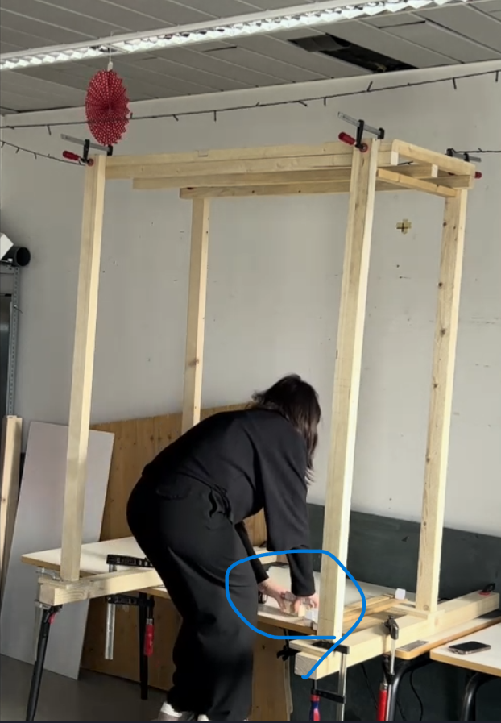 | 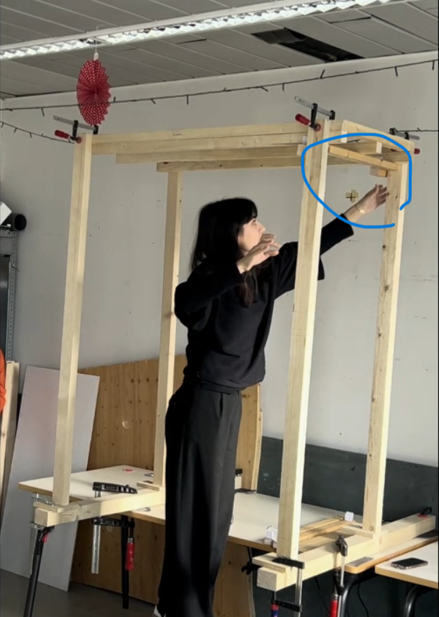 |

#### 1. Aligning

| Start: when the human touches the piece. | End: when the human releases the piece. |
| --- | --- |
| 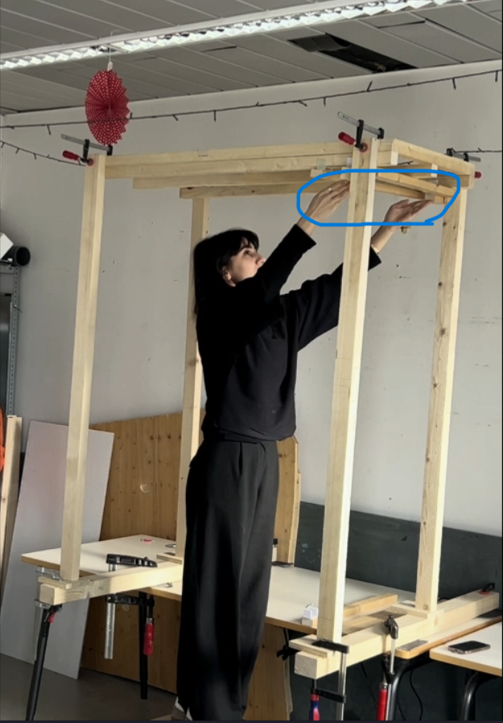 | 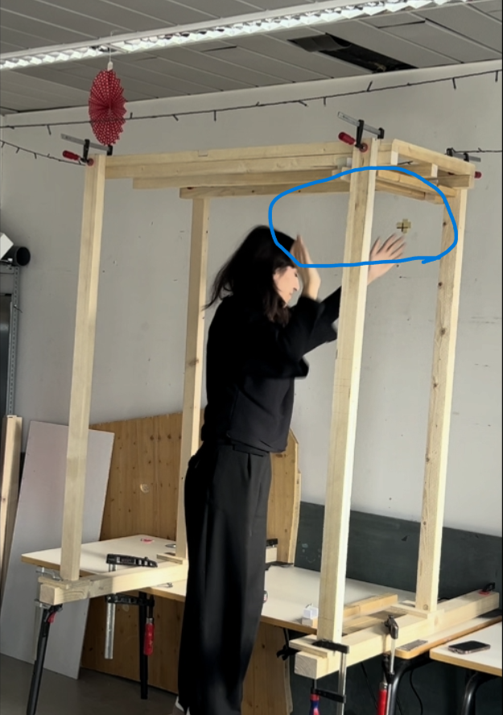 |

#### 2. Screwing

| Start: when the human picks up the screwdriver. | End: when the human puts the screwdriver away. |
| --- | --- |
| 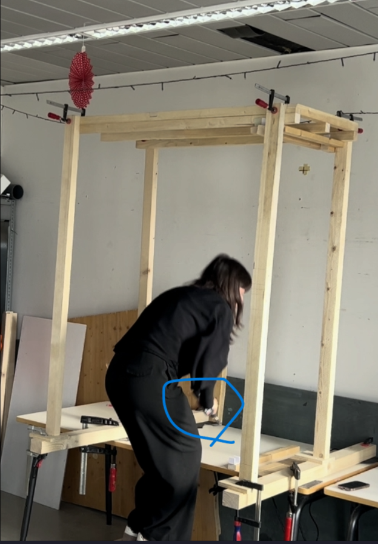 | 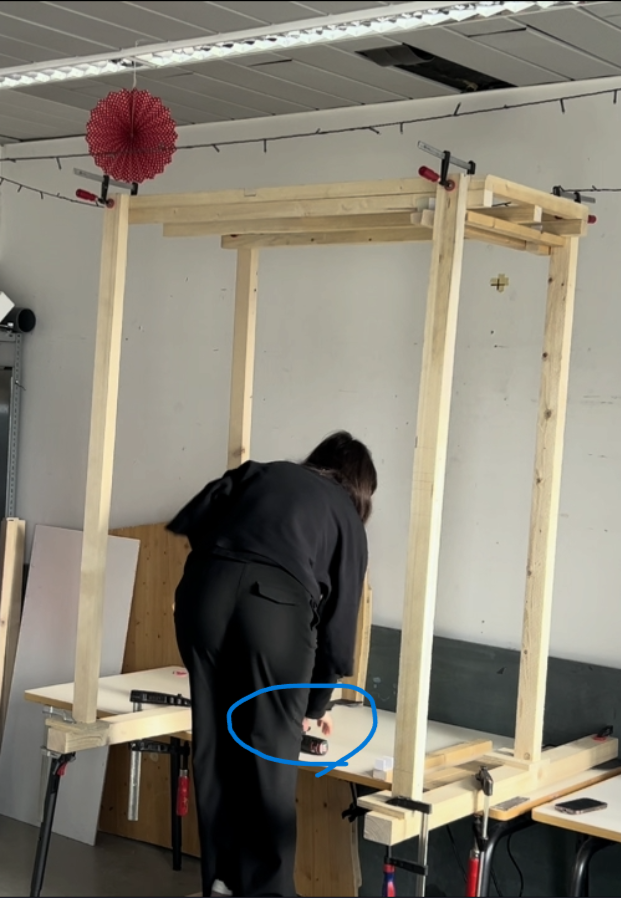 |

#### 3. Move spacers

| Start: when the human touches the spacer. | End: when the human releases the spacer. |
| --- | --- |
| 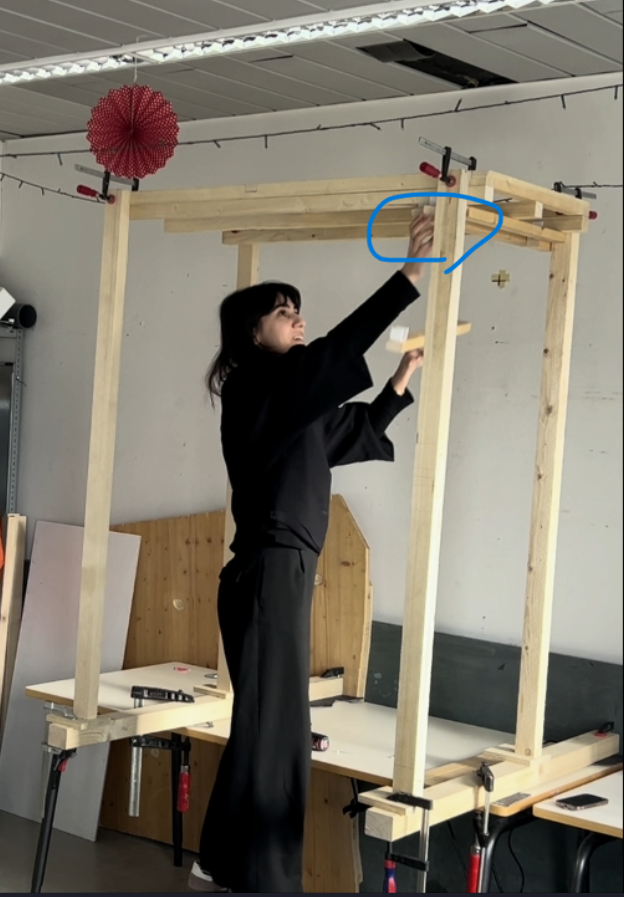 | 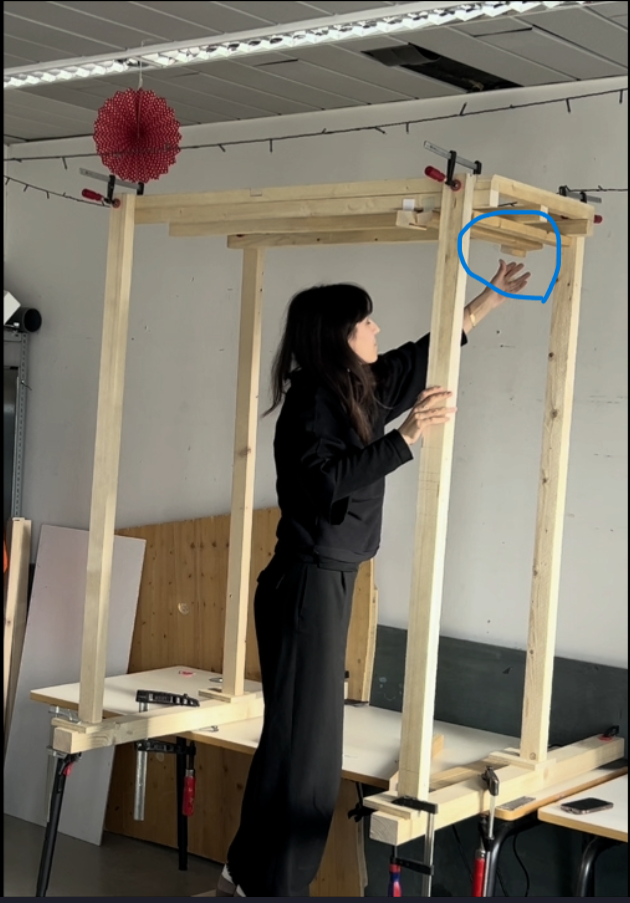 |

### Status ID Labeling

`status_id` is only assigned while the human is actively executing the relevant action. Motions such as searching for tools, repositioning, or moving between screwing locations should remain unlabeled for `status_id`.

#### 0. Putting spacers

| Start: when the spacer touches the ceiling frame. | End: when the human releases the spacer. |
| --- | --- |
| 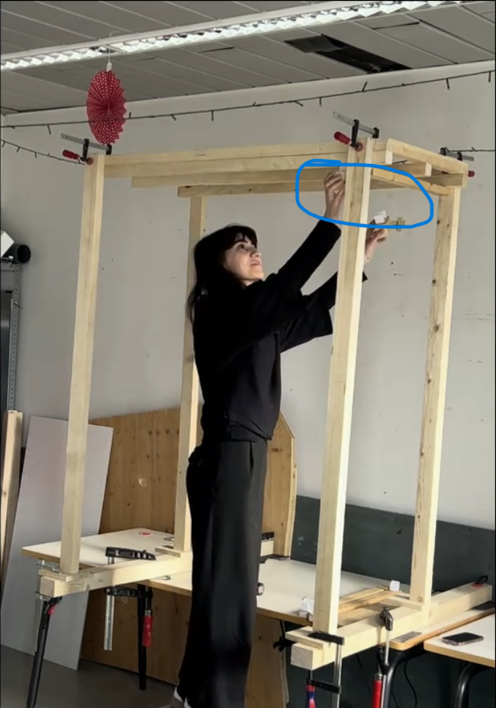 |  |

#### 1. Aligning

| Start: when the human touches the piece. | End: when the human releases the piece. |
| --- | --- |
|  |  |

#### 2. Screwing

- Start: when either the screwdriver or the screw first touches the piece.
- End: when the screwdriver is moved away from the piece.

Start examples:

| Example 1 | Example 2 | Example 3 |
| --- | --- | --- |
| 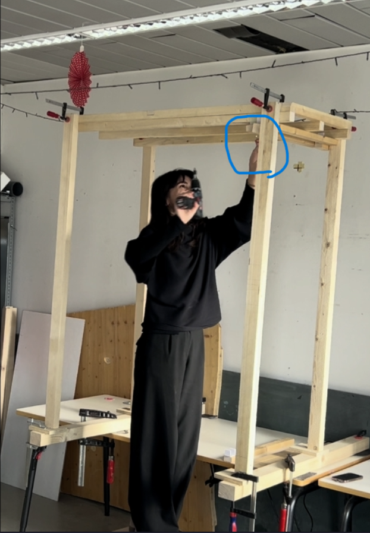 | 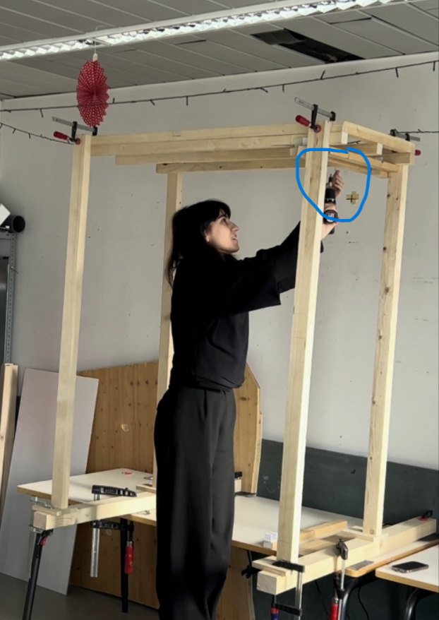 | 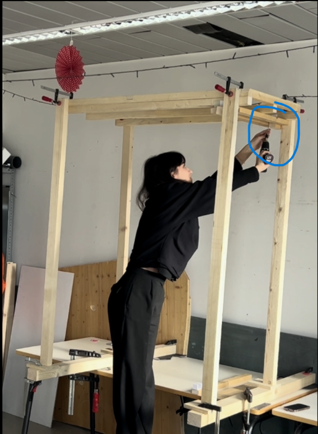 |

End examples:

| Example 1 | Example 2 | Example 3 |
| --- | --- | --- |
| 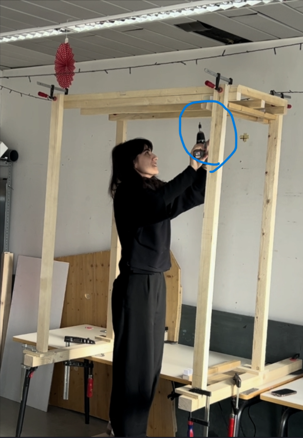 | 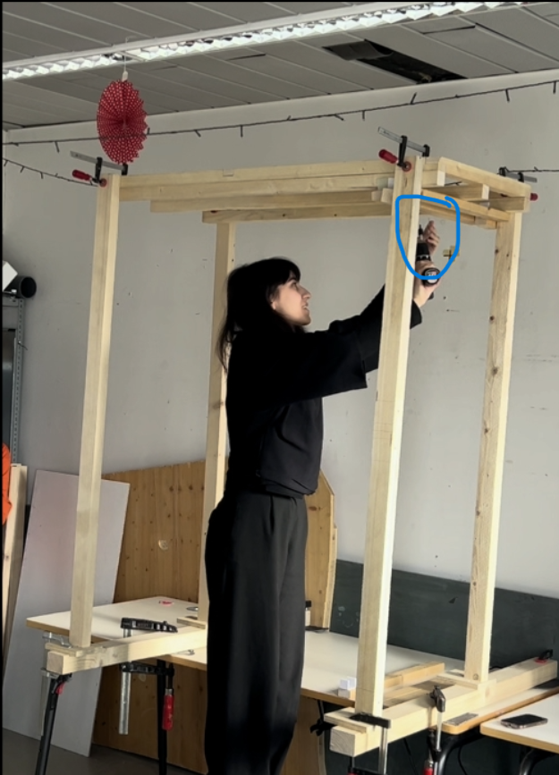 | 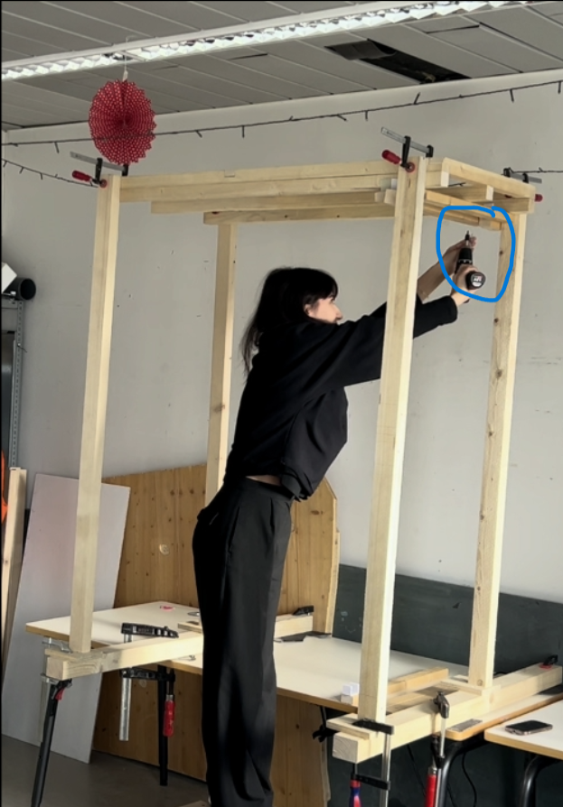 |

#### 3. Move spacers

| Start: when the human touches the spacer. | End: when the human releases the spacer. |
| --- | --- |
|  |  |

## Feature Extraction

Each extracted feature file is saved as `features__cam-XX_uid-YY_take-ZZ.pt`.

The filename is derived from the corresponding pose file:

`video__cam-XX_uid-YY_take-ZZ_pose.pt` -> `features__cam-XX_uid-YY_take-ZZ.pt`

Each `.pt` file is a Python dictionary saved with PyTorch. The source pose tensor is read from `proc_landmarks` with shape `(T, 17, 2)`, where `T` is the number of frames and `17` follows the COCO keypoint order.

```python
feature_dict = {
    "metadata": {...},
    "velocity": ...,
    "acceleration": ...,
    "velocity_xy": ...,
    "acceleration_xy": ...,
    "pol_vectors": ...,
    "pol_angles": ...,
    "angles": ...,
    "ratios": ...,
    "dist_ratios": ...,
}
```

### Top-level fields

| Key | Shape | Description |
| --- | --- | --- |
| `metadata` | dict | Metadata copied from the source pose file. Common entries include video path, FPS, model path, device, and tracking flag. |
| `velocity_scale` | `(T, 17)` | Per-keypoint velocity magnitude from `torch.diff(landmarks, dim=0)`. The missing leading frame is padded with the first detected velocity. |
| `acceleration_scale` | `(T, 17)` | Per-keypoint acceleration magnitude from `torch.diff(velocity, dim=0)`. The missing leading frames are padded with the first detected acceleration. |
| `velocity_xy` | `(T, 34)` | XY velocity vectors, flattened from `(T, 17, 2)`. The missing leading frame is padded with the first detected velocity. |
| `acceleration_xy` | `(T, 34)` | XY acceleration vectors, flattened from `(T, 17, 2)`. The missing leading frames are padded with the first detected acceleration. |
| `pol_vectors` | `(T, 34)` | Keypoint offsets from the body center, flattened from `(T, 17, 2)`. |
| `pol_angles` | `(T, 17)` | Polar angle of each keypoint around the body center in degrees. |
| `joint_angles` | `(T, 9)` | Joint-angle features in degrees. (0: left_elbow, 1: right_elbow, 2: left_shoulder, 3: right_shoulder, 4: left_hip, 5: right_hip, 6: left_knee, 7: right_knee, 8: neck) |
| `ratios` | `(T, 2)` | Ratios between configured inter-keypoint distances. (0: elbow/shoulder, 1: wrist/shoulder) |
| `dist_ratios` | `(T, 17)` | Distance of each keypoint from the body center, normalized by a hip-based baseline distance. |

### Feature definitions

- Body center for `pol_vectors`, `pol_angles`, and `dist_ratios`: mean of `left_hip`, `right_hip`, `left_shoulder`, and `right_shoulder`.
- Baseline for `dist_ratios`: distance between that body center and the mean of `left_hip` and `right_hip`.
- Angle column order in `angles`: `left_elbow`, `right_elbow`, `left_shoulder`, `right_shoulder`, `left_hip`, `right_hip`, `left_knee`, `right_knee`, `neck`.
- Ratio column order in `ratios`: `elbow/shoulder`, `wrist/shoulder`.

## Post-processing

The post-processing stage currently uses two groups of input parameters.

### 1. Time-forecasting model output

| Field | Type | Range | Description |
| --- | --- | --- | --- |
| Human step ID | int | 0-3 | Predicted task step label. |
| Human step probability | float | 0-1 | Confidence score for the predicted step. |
| Human status ID | int | 0-3 | Predicted action-status label. |
| Human status probability | float | 0-1 | Confidence score for the predicted status. |
| Human step progress | float | 0-1 | Estimated progress within the current step. |

### 2. Environment state

- Robot action time from picking up a part or tool to placing it, based on:
    - pickup location
    - assembly location
    - robot trajectory
- Robot approach time to the pickup location, based on:
    - approach trajectory
    - current robot position
    - current robot action state, including action type and progress
