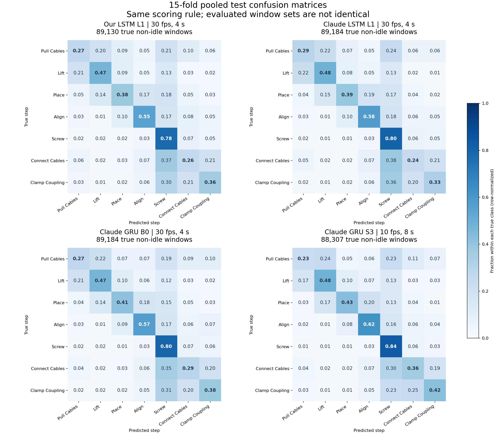
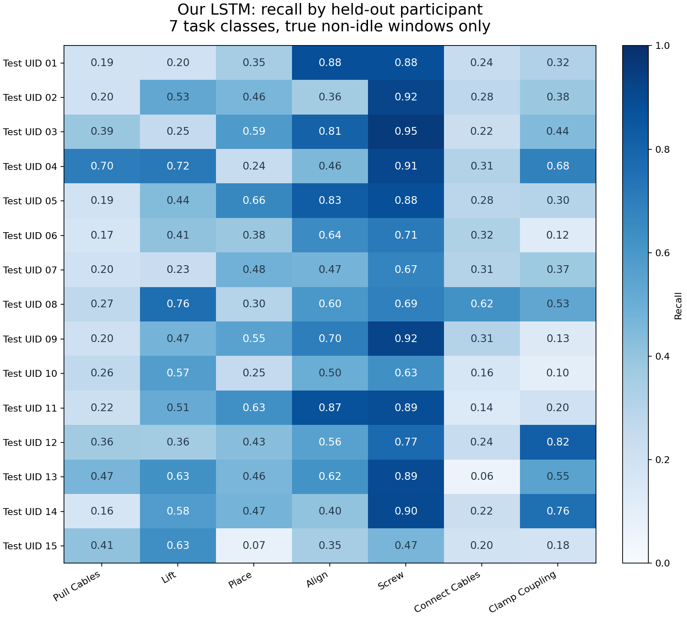

# recognition_gru 与 ablation_3d：性能差异核查

核查日期：2026-09-29。只做代码、配置和已有结果分析，没有修改训练代码，也没有启动训练。

对照版本：

- `recognition_gru`：`6e536110d8314f8cf8ab5a35fb8a32aeff86f988`。
- `ablation_3d`：`025dc936b993f44e07713b3608684152c8197776`。
- 我方最新结果：`model_lstm/runs_3d_tune/L1_LOSO_2026-09-29_11-19-36_618304/`。
- 核查期间工作区从 recognition_gru 切回了 ablation_3d；另一分支的内容通过 Git 对象读取，没有再次切换分支。

## 1. 主要结论

1. **最新我方 LSTM 已经接近 Claude LSTM 的结果。** 15 折 task macro-F1 为 **0.4508 ± 0.0761**，Claude L1 为 **0.4564 ± 0.0724**，均值差 **0.0056，即 0.56 个百分点**。这不是严格数值复现，但已不是最初看到的大差距。
2. **当前证据不支持把提升主要归功于 GRU 或 soft peak。** Claude 同配置 GRU 比 LSTM 高约 0.83 个百分点；早期报告中 soft peak 与 hard label 的整体 F1 很接近。
3. **我方已有日志里，扩大输入特征、调整优化设置最值得追踪。** 相同固定划分下，增加特征对应验证 F1 0.1956 → 0.2620；之后调整 AdamW、学习率、weight decay、dropout，对应 0.2620 → 0.3154。但这是单次运行，尚不能给每个因素分配独立因果贡献。
4. **在 Claude 后期 7 类实验中，10 fps 下扩大时间范围最值得迁移到 LSTM 验证。** 4 秒 → 8 秒对应 F1 0.4720 → 0.4898，不过同时改变了 epoch 数。继续增加 idle loss 权重后为 0.4992，但只在 7/15 人上提高，不能称为普遍改善。
5. **有一部分“变好”来自任务及评估定义变化。** 删除 Lift、排除真实 idle、改变标签生成规则，都会改变分数含义，不能直接与原来的 8 类完整分类比较。

## 2. recognition_gru 里并非只有一个模型版本

| 位置 | 内容与用途 | 比较时的限制 |
| --- | --- | --- |
| 根目录 `bench/` | 早期 hard/plateau/peak、mirror、去掉 Lift、pos_weight cap、focal、触发评估 | 当前 `DROP_LIFT=True`；需要 `--keep-lift` 才保留 Lift。旧数据类别顺序不同 |
| `test_gru/archive_round1_colleague/` | Round 1：全特征、减少特征、idle 输出方式的实验 | 当时数据中的 Lift 被删除，主要 task 指标为 6 类 |
| `test_gru/archive_round2/` | B0、F1、C1、S1、S2、S3、L1；重新生成标签、保留 Lift | 本次比较完整 7 类 LSTM/GRU 的主要依据 |
| `test_gru/bench/` | 后期训练及评估入口 | 核对过 data、engine、models、loso、run_night、make_eval，均与 Round 2 存档逐字节相同 |

根目录 `bench/run_all.sh` 还保留了当前 `train.py` 不再接受的 `--balanced` 参数，说明它是旧脚本；不能把它当作后期结果的准确启动命令。后期启动配置应以 `test_gru/bench/run_night.sh` 为准。

Round 2 的 `make_eval.py` 仍把一列叫作 `macro_f1_task6`，但它实际枚举当前全部非 idle task；L1/B0/S1–S3 的 CSV 和 per_class 文件对应 **7 类**。不要由这个旧列名误判。

## 3. 从原始方案到当前 L1，究竟改了什么

“原始方案”指保留的 `LSTM_train_mirror.ipynb` / `LSTM_model_train.py`；历史个别实验可能有不同配置，应以各次 config 为准。

| 项目 | 原始方案 | 当前我方 L1 与 Claude L1 的主要共同设置 |
| --- | --- | --- |
| 输入特征 | 7 组、91 维；更早一次实验为 89 维 | 16 组；235 维原始特征经 azimuth sin/cos 扩展为 251 维 |
| 特征预处理 | 选用的原始特征直接标准化 | azimuth 度数转 sin/cos；ratios 截断到 [0,4]，再标准化 |
| 时序输入 | 连续 160 帧，hop 30 | 连续 120 帧，hop 10，约 4 秒，预测末帧 |
| 主干 | 单层 LSTM，hidden 64 | 单层 LSTM，hidden 128 |
| 共享层 | Linear + ReLU + dropout 0.2 | Linear + ReLU + dropout 0.3 |
| step 目标 | 标量类别 ID，8 类 CE | 7 路 peak 软目标，BCEWithLogitsLoss |
| idle | 与 step 共用第 8 类 | 独立 binary head；idle 样本仍进入训练 |
| progress | 单一标量，所有窗口参与 | 7 路；仅 plateau >= 0.5 的活动通道参与 MSE |
| mistake | 两路 logits + CE | 一路 logit + 加权 BCE |
| loss 权重 | step/progress/mistake = 1/1/1 | step/progress/mistake/idle = 1/0.3/0.3/0.2 |
| 类别平衡 | WeightedRandomSampler + 加权 CE；另有 class7 系数 | 普通 shuffle，task pos_weight 按 peak>=0.5 计数，上限 2 |
| 优化 | Adam，lr=1e-4，weight_decay=0.01 | AdamW，lr=1e-3，weight_decay=1e-4 |
| 训练 | batch 32，60 epochs | batch 256，12 epochs，cosine scheduler，梯度范数上限 1 |
| 数据 | 原先固定 UID 划分和增强目录 | 每折 12 人训练、2 人验证、1 人测试；训练原件加一份镜像，val/test 原件 |
| 标准化 | 原固定训练集统计 | 每折训练数据每 7 帧采样；同折 train/val/test 共用该折统计 |
| 选模 | 最初按总 val loss；后来也保存 F1 最优 | 按真实非 idle 窗口的 7 类 val macro-F1 选测试模型 |

这里包含两种 representation 改动：**X 的输入特征扩大**，以及 **Y 的监督目标从单标签变为 7 路软目标**。soft peak 属于 target representation，不是把模型输入的人体特征变成了 7 路。

原来的整数 task_id 是 CE 的类别索引，并不是把 step 0–7 当连续数值做 L1/L2 回归；单个整数本身不是错误，也不强制模型认为相邻编号更相似。

## 4. 哪些提升有现成对照证据

### 4.1 我方已有中间实验：特征与优化设置

三次均为 soft-target 阶段、普通 shuffle、hidden 64、窗口 160/hop 30、batch 32、30 epochs，train UID 3–14、val UID 1/15、test UID 2。

| 实验目录末尾时间 | 与上一行的变化 | 最优 val task macro-F1 | 最优 epoch |
| --- | --- | --- | --- |
| `2026-09-29_00-28-07_948202` | 91 维输入；Adam 1e-4 / wd 0.01 / dropout 0.2 | 0.1956 | 24 |
| `2026-09-29_00-53-21_690263` | 全部特征，235 维；其余记录配置相同 | 0.2620 | 30 |
| `2026-09-29_01-23-32_005370` | AdamW 1e-3 / wd 1e-4 / dropout 0.3 | 0.3154 | 10 |

前两份 config 除特征列表、输入维数和备注外相同；后两份除四个优化参数和备注外相同。因此这是本项目目前支持“特征和优化设置值得优先研究”的直接线索。

限制：没有多随机种子重复；不同运行可能存在未记录的随机状态或代码变化；这里是验证集选模后的最好值，不是独立测试收益。不能断言其中某一种特征或 AdamW 单独贡献了全部提升。第三次备注写了 cosine，但保存的 `scheduler` 为 null，不能根据备注把这次收益归因于 cosine。

之前 weighted sampler 的 60-epoch 实验最优 val F1 为 0.2268，改普通 shuffle 的 30-epoch 实验为 0.1956；训练预算同时改变，所以已有记录不能证明“移除 sampler 提高性能”。

### 4.2 Claude Round 2：重算 15 折 CSV

以下均为每名测试参与者一行，再取 15 人等权均值；± 为总体标准差（ddof=0）。task F1/accuracy 只在真实非 idle 窗口计算。

| 实验 | 设置 | Task macro-F1 | Task accuracy | Idle F1 |
| --- | --- | --- | --- | --- |
| L1 | LSTM；30 fps，120 点，约 4 秒 | 0.4564 ± 0.0724 | 0.6218 | 0.6035 |
| B0 | GRU；其余同 L1 | 0.4647 ± 0.0737 | 0.6285 | 0.6120 |
| F1 | B0 只保留 7 组特征、121 维 | 0.4626 ± 0.0672 | 0.6302 | 0.6065 |
| C1 | B0 中 Screw、Clamp 的整条 task loss 通道乘 2 | 0.4721 ± 0.0745 | 0.6281 | 0.6161 |
| S1 | GRU；10 fps，40 点，约 4 秒 | 0.4720 ± 0.0748 | 0.6323 | 0.6046 |
| S2 | GRU；10 fps，80 点，约 8 秒；12→10 epochs | 0.4898 ± 0.0805 | 0.6608 | 0.6230 |
| S3 | S2 的 idle loss 权重 0.2→0.5 | 0.4992 ± 0.0865 | 0.6708 | 0.6198 |

| 配对变化 | F1 平均差，百分点 | 提高的参与者 | 可以得出的结论 |
| --- | --- | --- | --- |
| L1→B0：LSTM→GRU | +0.83 | 9/15 | 本轮结构差距小，不能解释原先的大幅差距 |
| B0→F1：删减特征 | -0.21 | 4/15 | 降维基本保留平均表现，但没有提高平均 F1 |
| B0→C1：两类 loss 加权 | +0.75 | 8/15 | 收益较小，不是所有参与者都改善 |
| B0→S1：约 4 秒不变，降低采样率 | +0.73 | 11/15 | 有方向性线索；不是只改变了序列长度而完全保持样本末帧不变 |
| S1→S2：约 4→8 秒，同时少训两轮 | +1.78 | 10/15 | 后期对照中更值得验证的组合，不能单独归因于窗口 |
| S2→S3：idle weight 0.2→0.5 | +0.94 | 7/15 | 平均 task F1 上升，但多数参与者并未提高；idle F1 反而略降 |

S3 相比 B0 总计 +3.45 个百分点；S3 相比 L1 总计 +4.28 个百分点，后者同时混入主干结构等变化。不能把这个总差都记为 GRU 的收益。

本次不将这些描述性结果宣称为统计显著或可必然迁移到 LSTM。每折只有一个初始化；不同 fold 训练集也重叠。

### 4.3 根目录 bench 的早期报告：soft peak 没有整体大跃升

`Recognition_Training_Results.pdf` 第 3 页报告的旧数据、7 类 GRU LOSO：

| 设置 | Task macro-F1 |
| --- | --- |
| hard argmax，无增强 | 0.386 |
| plateau，无增强 | 0.378 |
| plateau + mirror | 0.389 |
| peak，无增强 | 0.383 |
| peak + mirror | 0.392 |

在这批旧标签中，peak+mirror 对 Place 的 recall 为 0.38，plateau+mirror 为 0.12；Lift 则分别为 0.19 和 0.44。说明它主要重新分配了不同类别的表现，并非“BCE 比 CE 更公平，因此必然更好”。hard 与 vector 模式还同时涉及辅助输出头/损失的改变，不是纯粹只换一个 loss 函数的实验。

早期逐折 JSON/checkpoint 未随当前 Git 内容提供，以上是**报告记载**，本次没有独立重跑确认，证据等级低于可重新计算的 Round 2 CSV。

`Retrain_Results.pdf` 第 1–3 页记载：去掉 Lift 后 0.392→0.476；6 类模型加 pos_weight cap 后 0.480；再加 focal 后降为 0.444。删除 Lift 同时改变类别集合、真值和纳入评估的帧，因此 **0.392→0.476 不是原 7 类任务提高 8.4 个百分点的公平证据**。cap 对 lane precision 有益的报告结果可以参考；没有理由根据这批结果优先加 focal。

报告及代码中的“macro-F1/AP 不惩罚 false positive”和“自信但错误的负样本是 easy negative”解释不准确：F1 包含 precision，会受 FP 影响；对负样本高置信误报属于 hard negative。应采用实际实验结果，不照搬这些解释。

### 4.4 标签语义也经历了变化

早期 Lift 是包含 Place/Align 的长区间；Round 1 数据删除过 Lift；Round 2 的 `relabel.py` 使用 f30a14d 标签生成器，将 Lift 截到 Place/Align 开始前，保留 Lift，并重新生成 idle。

这属于**标签定义/区间的变化**，与将相同标签表示为 scalar、plateau、peak 是不同因素。Round 1 N1 的 0.4988 是 6 类成绩，不能直接用来声称比 Round 2 的 7 类 B0（0.4647）更好，也不能凭两轮分数孤立估计重标注收益。

## 5. 我方 L1 与 Claude L1：对齐程度及剩余差异

主要超参数、四个头的结构和 loss 公式一致，两边模型参数量均为 **213,648**。我方额外保存最低 val loss checkpoint，不影响默认使用最高 val task F1 checkpoint 进行测试。

| 指标 | 我方 L1 | Claude L1 |
| --- | --- | --- |
| 15 折 task macro-F1 | 0.4508 ± 0.0761 | 0.4564 ± 0.0724 |
| Idle F1 | 0.6064 | 0.6035 |
| Progress MAE，0–100 尺度 | 24.1310 | 24.3680 |
| Mistake F1 | 0.1159 | 0.1326 |

已验证：

- 15 折保存的 norm 文件 SHA-256 全部匹配各自 config 的记录，manifest 的 normalization_id 也全部匹配。
- 所有折的 val UID 与 Claude 的 `RandomState(1000 + test_uid)` 规则一致。
- 从我方 15 份 test_predictions.csv 重算 task F1，与各折 test_results.json 一致。
- 我方每折真实非 idle 评估集都包含全部 7 类；因此 Claude 未显式指定 labels 与我方指定 `range(7)` 在这些样本上的差异不是缺类导致的。

这些检查确认了保存结果的内部一致性，**不等于已经逐帧验证两边原始数据或全部导出的归一化数值相同**。

仍存在的实际差异：

1. **评估窗口集合不完全相同。** Claude L1 合计 89,184 个非 idle 窗口，我方为 89,130 个。只有 4/15 折数量相同；例如 UID 1 是 4,491 vs 4,478，UID 4 是 4,410 vs 4,413。数量相同也不能证明内容相同。原始数据快照、标签边界和 valid-window 筛选需要进一步按 recording+末帧比对，不能把差距全归为随机误差。
2. **有限值筛选时机不同。** Claude 先转换 float32、clip ratios，再判断特征是否有限；我方在原始特征上先判断，再转换。这可能改变带 inf ratio 的窗口是否保留；尚未证明它解释了实际的全部样本差异。
3. **统计计算精度不同。** Claude 的均值/标准差在 float32 特征上默认累加；我方用 float64 累加后存 float32。两者均只用训练集，但不保证统计数值完全相同；不建议为了逐位复现主动降低数值稳定性。
4. **训练文件及 shuffle 顺序不同。** Claude 先全部原件后全部镜像，再用全局 torch RNG 的 randperm；我方按 recording 交错原件与镜像，DataLoader 使用独立 generator。
5. **输出头初始化顺序不同。** Claude 依次 task、mistake、progress、idle；我方 step、progress、mistake、idle。实测相同 seed 下 LSTM、共享层、step、idle 初始权重一致，但 progress/mistake 不同。因此“同 seed”不代表训练过程完全一致。

## 6. 指标必须保持同一含义

Claude 的 headline task F1 实际回答：**已知这一帧是真实非 idle 时，7 个 step 的 argmax 是否正确？** 它使用真实 idle 排除样本，并不让预测 idle 参与 step 决策。

因此，真实 step 被 idle head 判成 idle 的错误，不会通过 idle head 进入这个 task F1；真实 idle 上的错误 step 响应也不计入它。对于之前“很多 step 被判成 class 7”的问题，还需要检查包括 idle 决策的完整指标。

我方最新已有完整 8 类、先由预测 idle 决策的指标：end-to-end macro-F1 **0.4407**，accuracy **0.5897**。它与 conditional 7 类 task F1 是互补指标，不能与 Claude 的 0.4992 直接当同一任务比较。

旧 7-lane 类别顺序为 Pull/Lift/Align/Screw/Connect/Clamp/Place；Round 2 与我方当前向量顺序为 Pull/Lift/Place/Align/Screw/Connect/Clamp。比较 confusion matrix 必须按类别名称对齐，不能直接比较相同数字行列。

## 7. 最有价值的下一轮对照

保留 LSTM。固定同一原始数据快照、标签、15 折划分、norm 规则、特征和评估方式，优先做以下实验，不一次更改全部条件：

1. **先统一可比较的评估窗口末帧。** 长短窗口在相同 recording 和末帧上比较，并使用所有设置共同有效的样本；同时保留各自全量结果。否则 win/stride 改动会同时改变受评估的目标样本。
2. **时间输入对照。** 120 点/30 fps/约4秒 → 40点/10 fps/约4秒；然后 40点/10 fps/约4秒 → 80点/10 fps/约8秒。固定训练预算规则，第二步不要同时改变 epochs；可以另报训练更新次数/计算量。
3. **idle loss 对照。** 在同一时间设置下比较 0.2 与 0.5，同时看 task F1、idle F1、完整8类F1及每类 recall。这里是增加独立 idle head 的训练权重，不等同于以前降低第8类 CE 权重。

如果论文重点是解释从旧模型到新模型的提升，还应另外安排两个受控对照：同一协议下 91维 vs 全特征；同一输入下旧优化设置 vs 新优化设置。需要研究 representation 时，再比较 hard CE/plateau BCE/peak BCE，保持数据和真值定义一致。任何改动至少补少量随机种子复核；测试折只用于最终报告，进一步调参应依赖训练/验证部分，避免把反复挑出的最高测试均值视为无偏估计。

## 8. 补充：为什么截图中的 confusion matrix 看起来更均衡

已核对 `test_gru/bench/report_round2.py` 的 Figure 4 说明：用户截图的 B0/S3 矩阵是 **15 名 held-out 参与者的测试计数相加，再按行归一化**。每人由对应折的模型预测，不是一个模型在 15 人上测试，也不是 15 个模型集成。S3 标题里的 exported 表示最终选择部署的配置，并不表示这里展示的是全数据重训后部署权重的测试矩阵。

按相同评分规则，重算我方最新 15 份 test_predictions.csv，得到如下对角线（recall）：

| 类别 | 我方 LSTM L1 | Claude LSTM L1 | Claude GRU B0 | Claude GRU S3 |
| --- | --- | --- | --- | --- |
| Pull Cables | 0.275 | 0.291 | 0.274 | 0.233 |
| Lift | 0.472 | 0.482 | 0.466 | 0.482 |
| Place | 0.378 | 0.393 | 0.412 | 0.428 |
| Align | 0.551 | 0.576 | 0.571 | 0.621 |
| Screw | 0.782 | 0.802 | 0.798 | 0.837 |
| Connect Cables | 0.256 | 0.243 | 0.290 | 0.360 |
| Clamp Coupling | 0.361 | 0.327 | 0.378 | 0.422 |

**同口径下，我方最新模型与 B0/L1 的混淆结构已经非常相似。** 我方 Connect→Screw 为 0.367，B0 为约 0.35；我方 Clamp→Screw 为 0.300，B0 为约 0.31。这些主要错误并不是只有我方才有。

单折的极端短板在汇总后容易不明显。例如我方 Place recall 在 UID 15 为 0.075、UID 5 为 0.662，汇总为 0.378；Clamp 在 UID 10 为 0.096、UID 12 为 0.820，汇总为 0.361。因此 pooled 矩阵不能说明每个参与者都表现均衡。每行汇总还按各参与者该类的样本数隐式加权，不等于 15 人 recall 的简单平均。

截图中的模型也没有完全解决不均衡：B0 的 Connect 有约 35% 被判为 Screw，超过其约 29% 的正确率；S3 的 Pull 正确率约 23%，仍有约 24% 被判为 Lift。S3 对后半段类别有改善，但 Pull 反而下降。

因此应分别回答两个问题：

- 为什么图看起来比某一折更均衡？首先是 15 折汇总与单折的差别，其次需确认是否比较了 7 类条件评估与包含 idle 的 8 类评估；按行归一化也让各类别拥有相同视觉面积，并不代表数量已平衡。
- 哪些改动实际改善了相似 step 的区分？现有 S1/S2/S3 对照支持优先验证更长时间上下文；它可能提供动作前后次序，但这仍是机制解释，尚未由单因素 LSTM 对照证明。不能由这张截图推导出 soft peak 或 GRU 单独解决了类别失衡。

## 来源定位

recognition_gru 分支（见文件开头的完整 commit）：

- `bench/data.py`、`bench/engine.py`、`bench/models.py`、`bench/loso.py`、`bench/run_arms.sh`、`bench/run_retrain.sh`。
- `Recognition_Training_Results.pdf` 第 1–3、5–6 页；`Retrain_Results.pdf` 第 1–3、5 页。报告用于历史结果，解释已与源码交叉核对。
- `test_gru/bench/run_night.sh:22–30`：Round 2 真实启动参数。
- `test_gru/bench/engine.py:47`：loss；`:88`：评估；`:150`：训练与选模。
- `test_gru/bench/data.py:215`：特征及标签；`:327`：窗口；`:366`：norm。
- `test_gru/bench/models.py`、`test_gru/bench/relabel.py`、`test_gru/bench/make_eval.py`。
- `test_gru/archive_round2/eval/*/metrics.csv`、`per_class.csv`；`archive_round1_colleague/eval/*/metrics.csv`。

ablation_3d 分支及本地结果：

- `model_lstm/LSTM_engine_tune.py`、`LSTM_model_train_tune.py`、`LSTM_databuilder_tune.py`、`LSTM_loso_tune.py`。
- `data_proc_2d/app/build_norm_dataset_tune.py`。
- `model_lstm/runs_3d_tune/L1_LOSO_2026-09-29_11-19-36_618304/{loso_summary.json,fold_results.json,fold_*/config.json,fold_*/test_predictions.csv,fold_*/norm_stats.npz}`。
- 本文列出的三次中间实验的 `config.json` 与 `summary_step_macro_f1.json`。
