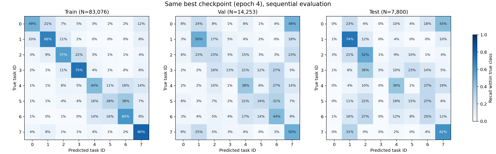
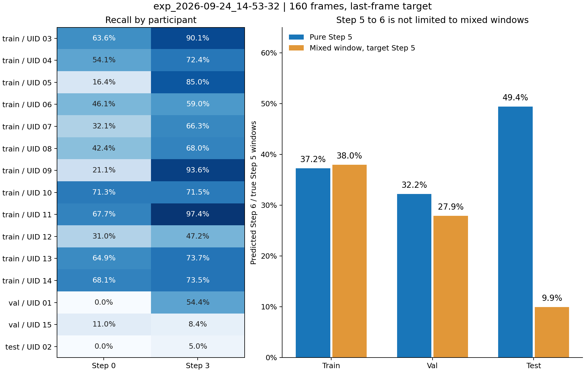

# 本次实验评估核查

实验：`exp_2026-09-24_14-53-32`。核查日期：2026-09-24。

本次已排除 train/val/test 归一化文件混用、特征顺序不一致和错误 checkpoint。Step 0、3 的问题在验证集已经出现；Step 3 明显依赖 participant。Step 5→6 在纯窗口中仍然严重，跨阶段窗口不能解释主要测试错误。

**1. 评估一致性：通过实测复现**

- 三组均使用本实验 `best_model.pth`，对应最佳总验证 loss 的 epoch 4；`model.eval()`，完整顺序遍历，`drop_last=False`，无重采样。
- notebook 的 train matrix 使用 `train_eval_loader`，训练过程使用的 `WeightedRandomSampler` 不参与该 matrix。训练日志中的 train accuracy 来自重采样分布和训练状态，不能直接当作此处 train matrix 的 accuracy。
- train/val/test 分别为 225/27/27 个文件、83,076/14,253/7,800 个窗口。train 各类计数与本次 config 完全一致。
- 全部 279 个文件、本次使用的全部 89 维输入，都与原始特征按 `norm_mirrored_2026-09-24.npz` 重算的结果逐元素一致。其他三个历史统计文件均不能逐文件精确匹配。
- notebook 寻址到的 2,511 个 NPY 缓存数组（279 × 9）全部存在，且与对应 NPZ 数组逐元素一致。
- 特征拼接顺序固定为 `distance_from_center → position_x_relative_to_pelvis → position_y_relative_to_pelvis → position_z_relative_to_pelvis → joint_angles → polar_elevation`。各特征内部列名及顺序在所有原始文件中一致。
- 三组均直接使用 `task_id`，范围为 0–7，无评估阶段重映射。NPZ 的 task/mistake 标签与原始 PT 完全相同，progress 等于原值除以 100。此处核验的是数字映射一致性，不是人工语义标注质量。
- 重建 `split_by_uid(seed=42)` 后，参与者划分与当前文件完全一致；按首次划分返回的训练文件顺序复算，所用 6 组 mean/std 全部逐元素复现保存值。统计文件来源可以对应到本次训练集。

| 数据集 | 完整评估 accuracy | Step loss | 复现情况 |
| --- | ---: | ---: | --- |
| train | 56.9117% | 1.175429 | 全量窗口，无重采样 |
| val | 35.6977% | 1.841551 | 与 best summary 的 accuracy 完全相同；总 loss 差约 1.3e-9 |
| test | 38.4231% | 1.700696 | 7,800 个窗口的 Step 和 mistake 预测与历史 CSV 全部一致 |

测试 progress 输出最大差为 5.96e-8，处于浮点计算误差量级。原始实验没有不可变的数据清单，因此以上结论基于当前文件、统计来源重建及历史输出复现。checkpoint/config/norm/notebook 的 SHA-256 已写入 [audit.json](audit.json)。



**2. Step 0、3：验证集已经退化，但要区分“很少预测”和“预测错误”**

| 数据集 | Step 0 recall（正确/真实） | 预测为 0 的窗口数/占比 | Step 3 recall（正确/真实） | 预测为 3 的窗口数/占比 |
| --- | ---: | ---: | ---: | ---: |
| train | 48.70%（1,458/2,994） | 3,432 / 4.13% | 74.63%（5,931/7,947） | 9,258 / 11.14% |
| val | 7.64%（36/471） | 642 / 4.50% | 13.46%（210/1,560） | 522 / 3.66% |
| test | 0.00%（0/252） | 27 / 0.35% | 5.04%（39/774） | 42 / 0.54% |

验证集并不是完全不输出 Step 0：它输出了 642 次，但只有 36 次正确；这是严重错判，而非单纯输出数量不足。测试集则确实几乎不输出 0、3。验证集真实 Step 0 主要错到 7（225/471）和 1（111/471）；真实 Step 3 主要错到 6（417/1,560）、4（321/1,560）和 2（282/1,560）。

| split / participant | Step 0 recall（support） | Step 3 recall（support） |
| --- | ---: | ---: |
| train / 03 | 63.64%（165） | 90.12%（516） |
| train / 04 | 54.05%（111） | 72.40%（576） |
| train / 05 | 16.36%（330） | 85.02%（621） |
| train / 06 | 46.07%（267） | 59.03%（432） |
| train / 07 | 32.14%（252） | 66.30%（828） |
| train / 08 | 42.42%（99） | 67.97%（693） |
| train / 09 | 21.11%（270） | 93.63%（612） |
| train / 10 | 71.33%（450） | 71.45%（1,734） |
| train / 11 | 67.71%（288） | 97.39%（459） |
| train / 12 | 30.95%（252） | 47.20%（375） |
| train / 13 | 64.91%（171） | 73.66%（558） |
| train / 14 | 68.14%（339） | 73.48%（543） |
| val / 01 | 0.00%（144） | 54.39%（171） |
| val / 15 | 11.01%（327） | 8.42%（1,389） |
| test / 02 | 0.00%（252） | 5.04%（774） |

Step 0 在两个验证参与者和测试参与者上都差，不能归因于某一个人；训练参与者 05、09 也较弱。Step 3 的验证错误主要集中在 UID 15：该人占验证 Step 3 样本的 89.04%，recall 只有 8.42%，而 UID 01 为 54.39%。

去掉跨阶段窗口后，UID 15 的纯 Step 3 recall 仍只有 9.17%（96/1,047），UID 01 为 66.67%（54/81）；测试 UID 02 为 2.50%（9/360）。因此 Step 3 的参与者差异不是由边界窗口单独造成的。

三个 split 的 participant 没有交集：train 为 03–14，val 为 01、15，test 只有 02。结果支持“对未见参与者泛化不稳”的判断，但测试仅一个参与者，不能据此估计所有人的表现，也不能单凭这些指标判定具体姿态差异或标注质量。

**3. Step 5→6：纯窗口也严重混淆**

当前标签取窗口最后一帧：160 帧输入、stride 30、offset 0；原始元数据 fps=30 时窗口约 5.33 秒。纯 Step 5 指 160 帧全为 5；跨阶段指目标为 5、但窗口内至少一帧不是 5。这里的“5→6”表示分类混淆，不等于视频中实际发生 5 到 6 的切换。

| split | 目标为 5 的窗口类型 | 窗口数 | Step 5 recall | 被预测为 6 的比例（数量） |
| --- | --- | ---: | ---: | ---: |
| train | 纯 Step 5 | 2,739 | 31.22% | 37.24%（1,020） |
| train | 跨阶段 | 3,666 | 26.35% | 37.97%（1,392） |
| val | 纯 Step 5 | 1,080 | 30.28% | 32.22%（348） |
| val | 跨阶段 | 387 | 4.65% | 27.91%（108） |
| test | 纯 Step 5 | 243 | 25.93% | 49.38%（120） |
| test | 跨阶段 | 333 | 6.31% | 9.91%（33） |

跨阶段确实增加 Step 5 的总体识别难度，尤其 val/test；但它不能解释主要的 Step 5→6 混淆：测试的 153 次 5→6 中，120 次（78.43%）来自纯 Step 5；验证集为 348/456（76.32%）。训练集纯 Step 5 的 5→6 错误率也已有 37.24%。

测试跨阶段 Step 5 更常被判成 2（120/333）、4（69/333）、1（60/333），而不是 6（33/333）。测试目标为 5 的窗口中，162/576（28.13%）的多数帧标签不是 5；跨阶段窗口内这一比例为 162/333（48.65%）。这说明“用最后一帧代表长窗口”有历史内容与当前标签不同的情况，但如果任务本来就是识别当前阶段，这并不自动构成错误标注。

推断：当前模型在纯窗口中也未充分区分 5 和 6；仅改成多数票标签不能解决这一现象。应优先检查纯 Step 5 被判为 6 的连续片段及其特征，再通过保持相同 participant 划分的短窗口/边界窗口对照实验检验窗口长度。多数票会改变预测目标，应作为单独实验。



**4. 额外发现：统计精度与增强副本**

归一化文件使用一致，但其生成方式存在数值精度问题。对相同训练数据用 float64 重算后，`distance_from_center` 的最大均值偏差为 0.01009，某维度达到 1.274 个真实标准差；最大 std 相对偏差为 61.81%。`joint_angles` 的最大均值偏差为 2.06995 度。保存值可由首次 split 顺序下的 float32 计算精确复现；按文件名排序复算 float32 又得到不同结果，证明统计计算明显依赖累计顺序。它不是 train/test 使用不同统计文件，但应在下一次训练前改成 float64 统计，并统一重建归一化数据。不能只给当前 checkpoint 的 test 换新统计量。

全部 93 组原视频（train/val/test 为 75/9/9）各有三个增强副本。在当前选用的 6 组特征及三个标签上，同一视频的 aug-01/02/03 SHA-256 完全相同。三种增强编号的评估指标也完全一致。本次所选输入上的增强实际只重复了样本，没有增加输入多样性；去重后三组窗口数为 27,692/4,751/2,600，recall 不变。报告中的计数按原实验保留三个副本，不代表相同数量的独立观测。原因是在增强生成还是特征提取环节，需要另行追踪。

**5. 可复查产物及范围**

本次新增独立审计脚本 [audit_evaluation.py](../../../audit_evaluation.py) 及本目录结果，未重训或改动原 notebook、checkpoint、数据生成逻辑。

- [audit.json](audit.json)：一致性结论、指纹、特征列顺序、统计量复算差异。
- [file_audit.csv](file_audit.csv)：逐文件归一化匹配、缓存检查、特征及标签内容指纹。
- [normalization_comparison.csv](normalization_comparison.csv)：每个文件、特征与各统计文件的比较。
- [participant_recall.csv](participant_recall.csv)、[class_metrics.csv](class_metrics.csv)：分参与者/类别的计数及 recall。
- [window_groups.csv](window_groups.csv)、[window_groups_by_participant.csv](window_groups_by_participant.csv)：纯/跨阶段分组结果。
- [train_predictions.csv](train_predictions.csv)、[val_predictions.csv](val_predictions.csv)、[test_predictions.csv](test_predictions.csv)：保留 participant、源文件、窗口帧位置、标签构成、切换序列和预测的逐窗口结果。

复算命令（仓库根目录、已安装 PyTorch/NumPy/pandas 的环境）：

```powershell
python -B model_lstm/audit_evaluation.py --run model_lstm/runs_3d/exp_2026-09-24_14-53-32 --norm data_proc_3d/dataset/norm_mirrored_2026-09-24.npz --data-root 'G:/.shortcut-targets-by-id/1nZZWQUKOdxeC-oo-NKucbuUj38ir4mZC/ITECH_Thesis/Videos/dataset/skeleton_3d/ceiling_panel_installation_04'
```

脚本使用 mirror notebook 已保存的文件加载列表恢复历史顺序；若 notebook 输出被清空或当前数据清单发生变化，会停止而不是静默更换数据。脚本重建数值审计 JSON/CSV，本文解释和 PNG 图为本次结果的静态报告。
